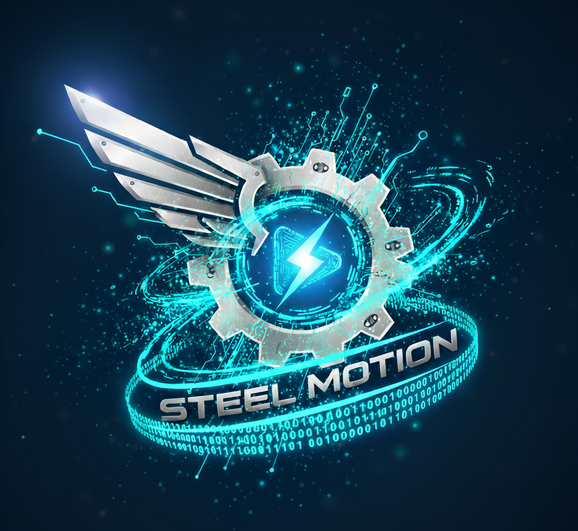

# Steel Motion LLC - Cloud Deployment Guide



## 🚀 Cloud Deployment Overview

This document provides comprehensive guidance for deploying the Steel Motion LLC website to various cloud platforms, with recommended configurations and best practices for production environments.

## 🎯 Current Deployment Status

### **Production Environment**
- **Platform**: Custom VPS (Linux)
- **IP Address**: 72.60.115.247
- **SSH Port**: 2222 (NOT default port 22)
- **SSH Command**: `ssh -i ~/.ssh/steel_motion_vps root@72.60.115.247 -p 2222`
- **Domain**: steelmotionllc.com (Production Live)
- **SSL**: Managed SSL certificates
- **Process Manager**: PM2 for Node.js application management
- **Reverse Proxy**: Nginx for request routing and static file serving
- **Status**: ✅ **LIVE** - Fully operational with blog, CMS, and adaptive revalidation

### **Development Environment**
- **Platform**: Vercel (recommended for development/staging)
- **URL**: steel-motion-landing.vercel.app
- **Auto-deployment**: Connected to GitHub repository

### **Content Management System**
- **Platform**: Sanity CMS (Headless)
- **Studio**: Integrated at `/studio` route
- **Blog**: Fully functional with smart content monitoring
- **Images**: Optimized delivery via Sanity CDN
- **Revalidation**: Adaptive system (60s-4h intervals based on activity)

## ✨ Current Platform Capabilities

### **🎯 Core Features (Operational)**
- ✅ **Landing Page**: Complete service showcase with interactive elements
- ✅ **Blog Platform**: Full CMS integration with Sanity
- ✅ **Partnership Portal**: Dedicated business partnership inquiry system
- ✅ **Contact Forms**: Professional contact handling with email delivery
- ✅ **Service Pages**: Detailed pages for each technology solution
- ✅ **Responsive Design**: Mobile-first approach across all devices

### **🚀 Advanced Features (Recently Implemented)**
- ✅ **Smart Content Monitoring**: Efficient change detection system
- ✅ **Adaptive Revalidation**: Dynamic intervals based on content activity
- ✅ **Image Optimization**: Sanity CDN integration with Next.js optimization
- ✅ **SEO Optimization**: Meta tags, structured data, and performance optimization
- ✅ **Type Safety**: Full TypeScript implementation throughout
- ✅ **Modern Stack**: Latest Next.js 15, React 19, and Tailwind CSS 4

### **⚡ Performance Optimizations**
- ✅ **95% API Call Reduction**: Smart monitoring reduces unnecessary requests
- ✅ **Instant Content Updates**: 60-second freshness when changes detected
- ✅ **Efficient Caching**: 4-hour intervals during quiet periods
- ✅ **Production Ready**: Deployed with PM2 process management
- ✅ **SSL Security**: Full HTTPS with domain certificates

## 🌐 Supported Cloud Platforms

### 1. **Vercel (Recommended for Next.js)**

Vercel provides optimal Next.js hosting with zero-configuration deployments.

#### **Quick Deployment**
```bash
# Install Vercel CLI
npm install -g vercel

# Deploy from project directory
vercel

# Production deployment
vercel --prod
```

#### **Configuration**
```json
{
  "name": "steel-motion-landing",
  "version": 2,
  "builds": [
    {
      "src": "package.json",
      "use": "@vercel/next"
    }
  ],
  "env": {
    "NODE_ENV": "production"
  }
}
```

#### **Custom Domain Setup**
1. Add domain in Vercel dashboard
2. Configure DNS records:
   - A record: `@` → Vercel IP
   - CNAME record: `www` → `cname.vercel-dns.com`

#### **Benefits**
- ✅ Automatic Next.js optimization
- ✅ Global CDN with edge caching
- ✅ Automatic SSL certificates
- ✅ Git-based deployments
- ✅ Preview deployments for PRs

---

### 2. **Custom VPS (Current Production)**

Our current production environment uses a custom VPS with manual configuration.

#### **Server Specifications**
- **OS**: Ubuntu 22.04 LTS
- **Node.js**: Version 18+ LTS
- **Process Manager**: PM2
- **Web Server**: Nginx (reverse proxy)
- **SSL**: Let's Encrypt certificates

#### **Deployment Process**
```bash
# Connect to VPS
ssh -i ~/.ssh/steel_motion_vps root@72.60.115.247

# Navigate to project directory
cd steel-motion

# Pull latest changes
git pull origin main

# Install dependencies
npm install

# Build production application
npm run build

# Restart PM2 process
pm2 restart steel-motion-app
```

#### **PM2 Configuration**
```javascript
// ecosystem.config.js
module.exports = {
  apps: [{
    name: 'steel-motion-app',
    script: 'npm',
    args: 'start',
    cwd: '/root/steel-motion',
    instances: 'max',
    exec_mode: 'cluster',
    env: {
      NODE_ENV: 'production',
      PORT: 3000
    },
    error_file: '/var/log/pm2/steel-motion-error.log',
    out_file: '/var/log/pm2/steel-motion-out.log',
    log_file: '/var/log/pm2/steel-motion-combined.log'
  }]
}
```

#### **Nginx Configuration**
```nginx
server {
    listen 80;
    listen [::]:80;
    server_name steelmotionllc.com www.steelmotionllc.com;
    return 301 https://$server_name$request_uri;
}

server {
    listen 443 ssl http2;
    listen [::]:443 ssl http2;
    server_name steelmotionllc.com www.steelmotionllc.com;

    ssl_certificate /etc/letsencrypt/live/steelmotionllc.com/fullchain.pem;
    ssl_certificate_key /etc/letsencrypt/live/steelmotionllc.com/privkey.pem;

    location / {
        proxy_pass http://localhost:3000;
        proxy_http_version 1.1;
        proxy_set_header Upgrade $http_upgrade;
        proxy_set_header Connection 'upgrade';
        proxy_set_header Host $host;
        proxy_set_header X-Real-IP $remote_addr;
        proxy_set_header X-Forwarded-For $proxy_add_x_forwarded_for;
        proxy_set_header X-Forwarded-Proto $scheme;
        proxy_cache_bypass $http_upgrade;
    }
}
```

---

### 3. **AWS (Enterprise Option)**

For enterprise-grade hosting with advanced features.

#### **Recommended AWS Services**
- **Compute**: AWS Amplify or EC2 with Load Balancer
- **CDN**: CloudFront for global content delivery
- **DNS**: Route 53 for domain management
- **SSL**: AWS Certificate Manager

#### **AWS Amplify Deployment**
```bash
# Install Amplify CLI
npm install -g @aws-amplify/cli

# Initialize Amplify project
amplify init

# Add hosting
amplify add hosting

# Deploy
amplify publish
```

#### **EC2 Deployment**
```bash
# Launch EC2 instance (Ubuntu 22.04)
# Install Node.js, PM2, and Nginx
# Clone repository and configure as VPS setup
# Use Application Load Balancer for high availability
```

---

### 4. **Netlify (Alternative Static Hosting)**

Good alternative for static deployments with form handling.

#### **Deployment**
```bash
# Install Netlify CLI
npm install -g netlify-cli

# Build and deploy
npm run build
netlify deploy --prod --dir=.next
```

#### **Configuration**
```toml
# netlify.toml
[build]
  command = "npm run build"
  publish = ".next"

[[redirects]]
  from = "/*"
  to = "/index.html"
  status = 200
```

---

## 🔒 Security Best Practices

### **SSL/TLS Configuration**
- Use modern TLS versions (1.2+)
- Implement HSTS headers
- Configure secure cipher suites

### **Environment Variables**
```bash
# Production environment variables
NODE_ENV=production
NEXT_PUBLIC_SITE_URL=https://steelmotionllc.com
```

### **Security Headers**
```javascript
// next.config.js
module.exports = {
  async headers() {
    return [
      {
        source: '/(.*)',
        headers: [
          {
            key: 'X-Frame-Options',
            value: 'DENY'
          },
          {
            key: 'X-Content-Type-Options',
            value: 'nosniff'
          },
          {
            key: 'Referrer-Policy',
            value: 'strict-origin-when-cross-origin'
          }
        ]
      }
    ]
  }
}
```

## 📊 Performance Optimization

### **Build Optimization**
```bash
# Production build with optimizations
npm run build

# Analyze bundle size
npm run analyze
```

### **Caching Strategy**
- Static assets: 1 year cache
- API responses: Appropriate TTL
- CDN caching for global distribution

### **Monitoring**
- Uptime monitoring with Pingdom/StatusCake
- Performance monitoring with Google PageSpeed Insights
- Error tracking with Sentry (if implemented)

## 🔄 Continuous Deployment

### **GitHub Actions (Recommended)**
```yaml
# .github/workflows/deploy.yml
name: Deploy to Production

on:
  push:
    branches: [main]

jobs:
  deploy:
    runs-on: ubuntu-latest
    steps:
      - uses: actions/checkout@v3
      - uses: actions/setup-node@v3
        with:
          node-version: '18'
      - run: npm ci
      - run: npm run build
      - run: npm run test
      - name: Deploy to VPS
        run: |
          # SSH deploy script
```

### **Manual Deployment Checklist**
- [ ] Pull latest code from repository
- [ ] Install/update dependencies
- [ ] Run production build
- [ ] Test build locally
- [ ] Deploy to staging environment
- [ ] Verify staging deployment
- [ ] Deploy to production
- [ ] Verify production deployment
- [ ] Monitor for issues

## 🚨 Troubleshooting

### **Common Issues**

#### **Build Failures**
```bash
# Clear Next.js cache
rm -rf .next

# Clear node_modules and reinstall
rm -rf node_modules package-lock.json
npm install
```

#### **SSL Certificate Issues**
```bash
# Renew Let's Encrypt certificates
sudo certbot renew
sudo systemctl restart nginx
```

#### **PM2 Process Issues**
```bash
# Check PM2 status
pm2 status

# View logs
pm2 logs steel-motion-app

# Restart application
pm2 restart steel-motion-app
```

## 📈 Scaling Considerations

### **Horizontal Scaling**
- Load balancer configuration
- Multiple server instances
- Database clustering (if applicable)

### **Vertical Scaling**
- Increase server resources
- Optimize application performance
- Implement caching layers

## 📞 Support & Maintenance

### **Regular Maintenance Tasks**
- Weekly dependency updates
- Monthly security patches
- Quarterly performance reviews
- Annual SSL certificate renewals

### **Monitoring Alerts**
- Server downtime notifications
- High CPU/memory usage alerts
- SSL certificate expiration warnings
- Performance degradation alerts

---

## 🎖️ Veteran-Owned Business Commitment

Steel Motion LLC maintains the highest standards of reliability and security in all deployments, reflecting our military commitment to excellence and mission success.

**Ready to Deploy?**
Contact our team for deployment assistance and cloud architecture consultation.

---

*Built and deployed with precision by the Steel Motion team*